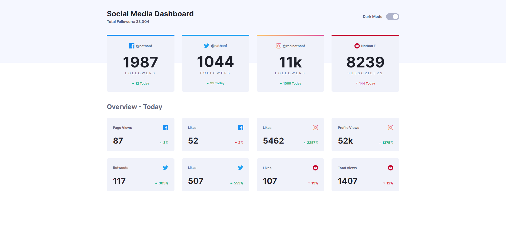

# Frontend Mentor - Social media dashboard with theme switcher solution

This is a solution to the [Social media dashboard with theme switcher challenge on Frontend Mentor](https://www.frontendmentor.io/challenges/social-media-dashboard-with-theme-switcher-6oY8ozp_H). Frontend Mentor challenges help you improve your coding skills by building realistic projects. 

## Table of contents

- [Overview](#overview)
  - [The challenge](#the-challenge)
  - [Screenshot](#screenshot)
  - [Links](#links)
- [My process](#my-process)
  - [Built with](#built-with)
  - [What I learned](#what-i-learned)
  - [Useful resources](#useful-resources)
- [Author](#author)

## Overview

### The challenge

Users should be able to:

- View the optimal layout for the site depending on their device's screen size
- See hover states for all interactive elements on the page
- Toggle color theme to their preference

### Screenshot



### Links

- Live Site URL: [Social media dashboard with theme switcher challenge](https://kriosaber.github.io/social-media-dashboard-with-theme-switcher-master/)

## My process

### Built with

- Semantic HTML5 markup
- CSS custom properties
- Flexbox
- CSS Grid
- Mobile-first workflow
- JavaScript

### What I learned

I made the toggle switch based on one of my previous challenges solutions:
  [Interactive pricing component](https://kriosaber.github.io/interactive-pricing-component-main/) 

As for the dark theme, the simplest solution I thought of was adding a class to the body to change my color variables 

```css
:root{
  --clr-bg: hsl(0, 0%, 100%);
  --clr-bg-pattern: hsl(225, 100%, 98%);
  --clr-card: hsl(227, 47%, 96%);
  --clr-card-active: hsl(232, 33%, 91%);
  --clr-text: hsl(228, 12%, 44%);
  --clr-heading: hsl(230, 17%, 14%);
}

.dark-theme{
  --clr-bg: hsl(230, 17%, 14%);
  --clr-bg-pattern: hsl(232, 19%, 15%);
  --clr-card: hsl(228, 28%, 20%);
  --clr-card-active: hsl(228, 26%, 27%);
  --clr-text: hsl(228, 34%, 66%);
  --clr-heading: hsl(0, 0%, 100%);
}
```
```js
themeInput.addEventListener('change', () => document.body.classList.toggle('dark-theme'));
```

### Useful resources

- [Interactive pricing component](https://kriosaber.github.io/interactive-pricing-component-main/) - This helped me for the toggle switch styling

## Author

- Frontend Mentor - [@Kriosaber](https://www.frontendmentor.io/profile/Kriosaber)